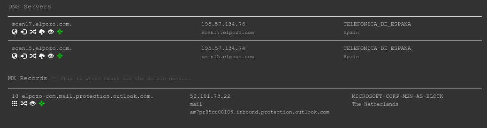
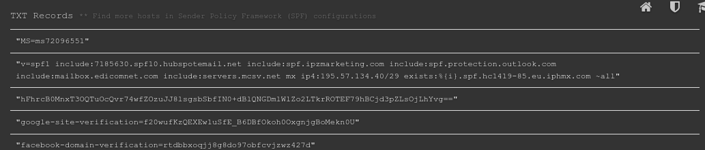

# A08. Mapa DNS

## Introducción

En una primera etapa de auditoría, se os pide recopilar toda la información sobre la infraestructura de la empresa “El POZO” disponible en fuentes abierta. Utiliza herramientas y técnicas de OSINT (Open Source Intelligence) para recabar datos esenciales que serán cruciales en las etapas posteriores de la auditoría.  

## Uso de whois

Usaremos el comando para obtener la siguiente infromación.

``` bash
carlosmofe@carlosmofe-MS-7C39:~/Descargas$ whois elpozo.com
   Domain Name: ELPOZO.COM
   Registry Domain ID: 1181800_DOMAIN_COM-VRSN
   Registrar WHOIS Server: https://www.arsys.es/dominios/whois
   Registrar URL: http://www.arsys.es
   Updated Date: 2023-05-19T09:34:34Z
   Creation Date: 1997-05-23T04:00:00Z
   Registry Expiry Date: 2024-05-24T04:00:00Z
   Registrar: Arsys Internet, S.L. dba NICLINE.COM
   Registrar IANA ID: 379
   Registrar Abuse Contact Email: abuse@nicline.com
   Registrar Abuse Contact Phone: +34 941 620 100
   Domain Status: ok https://icann.org/epp#ok
   Name Server: SCEN15.ELPOZO.COM
   Name Server: SCEN17.ELPOZO.COM
   DNSSEC: unsigned
   URL of the ICANN Whois Inaccuracy Complaint Form: https://www.icann.org/wicf/
>>> Last update of whois database: 2023-11-22T11:40:36Z <<<
```
Obtenemos el Registrar, la fecha de creación siendo esta el 23/05/1997, los nombre de los servidores DNS, **SCEN15.ELPOZO.COM** y **SCEN17.ELPOZO.COM**, el dominio lo han comprado en **Arsys Internet, S.L.**
Como vemos no nos da suficiente información así que usaremos más herramientas.

## Uso de nslookup

``` bash
carlosmofe@carlosmofe-MS-7C39:~/Descargas$ nslookup elpozo.com
Server:		127.0.0.53
Address:	127.0.0.53#53

Non-authoritative answer:
Name:	elpozo.com
Address: 195.57.134.66
```

Como vemos, obtenemos la ip del servidor web, siendo esta 192.57.134.66.

## who.is para obtener email de administración

Ninguna de las herramientas anteriores nos ha dado ninguna informaciónd e contacto para ela dministrador, para ello he usado la página [who.is](https://who.is/dns/elpozo.com) y he obtendio lo siguiente.

![[ELPOZO/img/3.png]]

## bgp.he.net para obtener el sistema autónomo

Con todas las herramientas anteriores no hemos obtenido el sistema autónomo, para ello usaremos la pagina web [bgp.he.net](https://bgp.he.net/ip/195.57.134.66) para obtenerlo, nos dará la siguiente información.

![[ELPOZO/img/4.png]]
Como vemos, obtenemos el idenificador del sistema autónomo y podemos investigar más haciendo clcik al enlace con el identificador y veremos que la compañía detrás es Telefónica.

![[ELPOZO/img/5.png]]
## Uso de dnsdumpster

Con esta herramienta web vamos a obtener un mapa de sus servidores y subdominios, además de todos sus registros dns.

En la siguiente captura vemos ambos servidores DNS con sus IP, el ISP, siendo **Telefónica** y el registro MX, que corresponde con su servidor de correos.



En la siguiente captura tenemos los registros TXT.



## Listado de hosts y subdominios

Entre los subdominios, DNS dumpster nos proporciona los siguientes

| Host  | IP  |
|---|---|
|bienstar2.elpozo.com|35.214.236.46|
|promo1954.elpozo.com|160.153.129.232|
|scen15.elpozo.com|195.57.134.74|
|scen17.elpozo.com|195.57.134.76|
|china.elpozo.com|103.254.208.249|
|ac.elpozo.com|195.57.134.68|
|mail.elpozo.com|195.57.134.65|
|seleccion.elpozo.com|195.57.134.66|
|correo.elpozo.com|195.57.134.44|
|promo.elpozo.com|128.199.49.161|
|bienstar.elpozo.com|195.57.134.66|
|promobienstar.elpozo.com|128.199.49.161|
|agentes.elpozo.com|195.57.134.66|
|empanados.elpozo.com|217.182.28.211|
|calledemisabuelos.elpozo.com|195.57.134.66|
|srv.elpozo.com|195.57.134.66|
|www.elpozo.com|195.57.134.66|
|scen17.elpozo.com.|195.57.134.76|
|scen15.elpozo.com.|195.57.134.74|
|10 elpozo-com.mail.protection.outlook.com.|52.101.73.22|

El mapa del dominio quedaría así:

[Enlace al mapa](https://dnsdumpster.com/static/map/elpozo.com.png)

## Presencia de la empresa en redes

La presencia en redes sociales de una empresa es un terreno fértil para los ciberdelincuentes por varias razones. Entre ellas, estas plataformas ofrecen una gran cantidad de información pública que puede ser explotada para ingeniería social y ataques de phishing.

Las redes sociales relacionadas con elpozo son:

[Twitter](https://twitter.com/ElPozoAlimenta)

[Facebook](https://www.facebook.com/ElPozoAlimentacion/?locale=es_ES)

[Instagram](https://www.instagram.com/elpozoalimentacion/)

[YouTube](www.youtube.com/user/spotespeciales)

[Linkedin](https://www.linkedin.com/company/elpozo-alimentacion-s.a./?originalSubdomain=es)

Siendo de ellas la más importante Linkedin, ya que nos proporciona acceso a contactos de los diferentes empleados de la empresa y más información sobre que perfiles busca la empresa y qué tecnologías usa. Además en su LInkedin obtenemos la siguiente información:

- Sitio web: [http://www.elpozo.com](http://www.elpozo.com/)
- Teléfono: 968636800
- Sector: Servicios de alimentos y bebidas
- Tamaño de la empresa: 1001-5000 empleados
- [1241 miembros asociados](https://www.linkedin.com/search/results/people/?currentCompany=%5B%22942923%22%5D&origin=COMPANY_PAGE_CANNED_SEARCH) 
- Sede: ALHAMA DE MURCIA, MURCIA
- Fundación: 1954