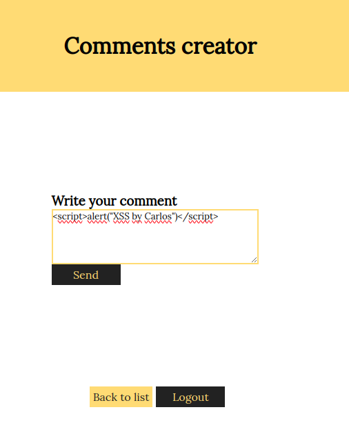
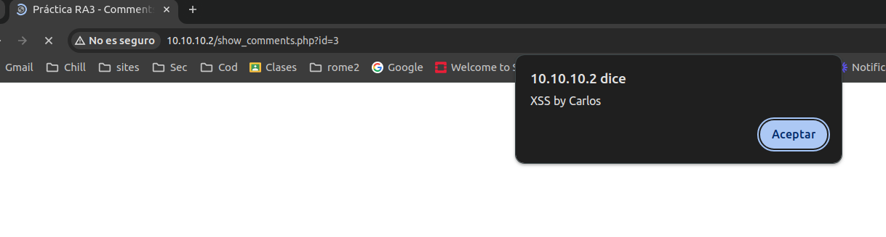
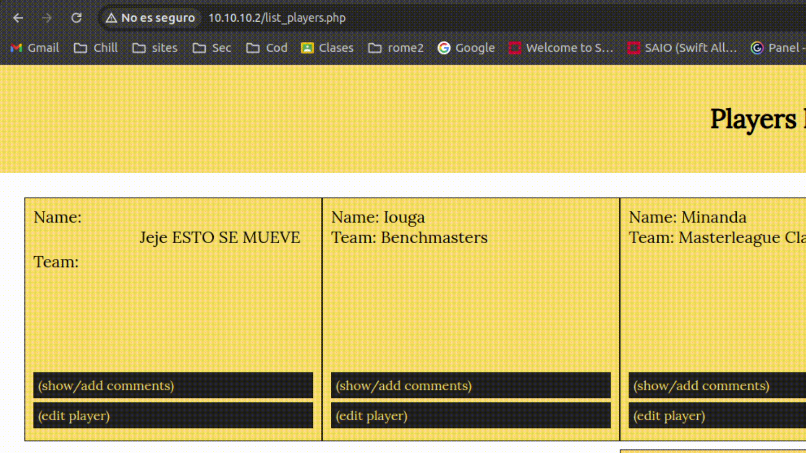
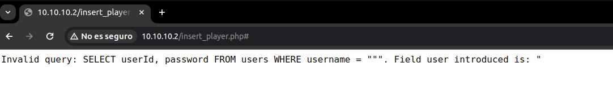

# Evaluación de aplicación web - **Talent ScoutTech**
# IP-0001

Version: 0.1

ANPIPADA Ltd.

Plaza Jaén nº1 5ºC esc. derc

San Fernando, Cádiz 11100

Realizado por: Carlos Montesino Fernando

Email: cmonfer392@g.educaand.es

Fecha: 10/05/2024

# Índice

1. Sobre este documento
	1. Información del documento
	2. Distribución del documento
2. Resumen ejecutivo
	1. Ámbito y alcance
	2. Advertencias
	3. Tabla de riesgos
	4. Breve resumen
3. Vulnerabilidades destacadas
	1. Conclusión
4. Metodologías
5. Datos equipo

# Sobre este documento
El presente documentos contiene información confidencial, la información contenida en el mismo no está sujeta a modificación o copias sin permiso del autor.
## Información del documento

| Control sobre el documento |                              |
| -------------------------- | ---------------------------- |
| Clasificación              | Confidencial                 |
| Cliente                    | Talent ScoutTech             |
| Referencia                 | IP-0001                      |
| Documento                  | Evaluación de aplicación web |
| Autor                      | Carlos Montesino Fernando    |

| Versión | Fecha    | Estado     |
| ------- | -------- | ---------- |
| 0.1     | 10/05/24 | Finalizado |

| Personal autorizado       |                   |                  |
| ------------------------- | ----------------- | ---------------- |
| Nombre                    | Función           | Empresa          |
| Carlos Montesino Fernando | Auditor           | ANPIPADA SL.     |
| Luis Perez Farnesio       | Responsable IT    | Talent ScoutTech |
| Lebron Raimundo Jaime     | Mánager ejecutivo | Talent ScoutTech |

# Resumen ejecutivo

## Ámbito y alcance

En este caso Talent ScoutTech ah contratado los servicos de ANPIAPDA SL. para realizar una auditoria de una aplicación web en búsqueda de diferentes vulnerabilidades en el código. La evaluación ha sido realizada entre los días 7 de Mayo de 2024 y 10 de Mayo de 2024.

Para la auditoria se ha proporcionado el código de la aplicación convirtiendo esta auditoría en una de tipo "Caja Blanca", el auditor ha sido responsable de desplegar la aplicación en un servidor web propio que en este caso ha correspondido a la IP 10.10.10.2.

## Advertencias

Las pruebas han sido realizadas en un entorno controlado por el auditor, por lo que no se asegura tener exactamente los mismos resultados en un entorno real.
## Tabla de riesgos

Las vulnerabilidades encontradas se encuentran clasificadas en función del riego y puntuación CVSSv3, siguiendo la siguiente tabla:

| Riesgo      | CVSSv3    | Descripción                                                                           |
| ----------- | --------- | ------------------------------------------------------------------------------------- |
| Crítico     | 9.0 -10   | Requiere una solución inmediata                                                       |
| Alto        | 7.0 - 8.9 | La solución deberá ser a corto plazo                                                  |
| Medio       | 4.0 - 6.9 | La resolución del la vulnerabilidad se considerará parte del mantenimiento del mismo. |
| Bajo        | 1.0 - 3.9 | Debe ser aborda como parte del mantenimiento diario.                                  |
| Informativo | 0 - 0.9   | Buenas prácticas para cumplir con estándares de seguridad.                            |

## Breve resumen

Durante la auditoria se han encontrado diferentes vulnerabilidades en el código de la aplicación, que pondrían al negocio en peligro afectando a la confidencialidad, integridad e incluso disponibilidad de la aplciación.

| Parte auditada | Crítico | Alto | Medio | Bajo | Info | Total |
| -------------- | ------- | ---- | ----- | ---- | ---- | ----- |
| Aplicación web | 2       | 1    | 1     | 0    | 0    | 4     |

# Vulnerabilidades destacadas

Las vulnerabilidades descubiertas durante el proceso de investigación han sido:

| Descripción        | Inyección SQL                                                                                                                                                                                           |
| ------------------ | ------------------------------------------------------------------------------------------------------------------------------------------------------------------------------------------------------- |
| CVE/CWE            | CWE-89: Improper Neutralization of Special Elements used in an SQL Command ('SQL Injection')                                                                                                            |
| CVSS v3            | 9.8                                                                                                                                                                                                     |
| Criticidad         | Crítico                                                                                                                                                                                                 |
| Impacto            | Se puede realizar una inyección SQL en el formulario de inicio de sesión que permite autenticarse como cualquier otro usuario o realizar consultas y cambios en la base de datos.                       |
| Prueba de Concepto |                                                                                                                                                                                         |
| Remediación        | Hacer uso de buenas prácticas de programación y realizar un saneamiento de la entrada del usuario, usando funciones que eviten los carácteres usados en inyecciones SQL como `bindValue` o `prepare()`. |
| Referencias        | https://owasp.org/www-community/attacks/SQL_Injection                                                                                                                                                   |
| Url afectada       | http://10.10.10.2/private/auth.php llamada al intentar iniciar sesión las url como http://10.10.10.2/insert_player.php#.                                                                                |

| Descripción        | Cross Site Scripting                                                                                                                                                                                                                                        |
| ------------------ | ----------------------------------------------------------------------------------------------------------------------------------------------------------------------------------------------------------------------------------------------------------- |
| CVE/CWE            | CWE-79: Improper Neutralization of Input During Web Page Generation                                                                                                                                                                                         |
| CVSS v3            | 9.8                                                                                                                                                                                                                                                         |
| Criticidad         | Crítico                                                                                                                                                                                                                                                     |
| Impacto            | El formulario que permite crear comentarios no valida correctamente la entrada y permite a un atacante ejecutar por ejemplo, código javascript, que además se almacena en la base de datos y se ejecutaría en cualquier navegador que abra la url objetivo. |
| Prueba de Concepto |                                                                                                                                                                                                                             |
| Remediación        | Realizar una correcta validación de los parámetros introducidos en los comentarios, usando funciones como `htmlspecialchars()` que se usa para convertir los caracteres especiales en entidades HTML.                                                       |
| Referencias        | https://owasp.org/www-community/attacks/xss/                                                                                                                                                                                                                |
| Url afectada       | http://10.10.10.2/add_comment.php?id=3                                                                                                                                                                                                                      |

| Descripción        | Cross Site Scripting HTML                                                                                                                                                                                           |
| ------------------ | ------------------------------------------------------------------------------------------------------------------------------------------------------------------------------------------------------------------- |
| CVE/CWE            | CWE-79: Improper Neutralization of Input During Web Page Generation                                                                                                                                                 |
| CVSS v3            | 8.2                                                                                                                                                                                                                 |
| Criticidad         | Alta                                                                                                                                                                                                                |
| Impacto            | Es posible para un atacante introducir elementos HTML usando el formulario de creación de equipos, pudiendo modificar la apariencia de la página incluyendo, por ejemplo, botones que redirigen a links maliciosos. |
| Prueba de Concepto |                                                                                                                                                                                                     |
| Remediación        | Realizar una correcta validación de los parámetros introducidos en los comentarios, usando funciones como `htmlspecialchars()` que se usa para convertir los caracteres especiales en entidades HTML.               |
| Referencias        | https://owasp.org/www-community/attacks/xss/                                                                                                                                                                        |
| Url afectada       | http://10.10.10.2/list_players.php                                                                                                                                                                                  |

| Descripción        | Debug activado, proporcionando información(Information Disclosure)                                                                |
| ------------------ | --------------------------------------------------------------------------------------------------------------------------------- |
| CVE/CWE            | CWE-200: Exposure of Sensitive Information to an Unauthorized Actor                                                               |
| CVSS v3            | 5.3                                                                                                                               |
| Criticidad         | Media                                                                                                                             |
| Impacto            | La inyección SQL provoca la posibilidad para una tacante de obtener información sobre el funcionamiento interno de la aplicación. |
| Prueba de Concepto |                                                                                                                   |
| Remediación        | Deshabilitar la opción de debuging de la aplicación .                                                                             |
| Referencias        | https://www.zaproxy.org/docs/alerts/10023/                                                                                        |
| Url afectada       | http://10.10.10.2/private7auth.php                                                                                                |

## Conclusión

Se concluye que la aplicación auditada no es segura y necesita arreglos de suma urgencia, como es obvio no se recomiendo que esta aplicación llegue a producción  sin los parches especificados.

Los principales problemas encontrados son debido al mal saneamiento y manejo de las entradas de los usuarios, permitiendo a un atacante escribir información en la base de datos y modificar por completo el contenido de la aplicación web.
# Metodologías

La metodología seguida durante esta auditoria ha sido la OWASP Web Security Testing Guide v4.2

Referencia: https://owasp.org/www-project-web-security-testing-guide/
# Datos del equipo

Los encargados de realizar esta auditoria han sido:

| Rol     | Nombre                    | Cualificación                  | Función                               |
| ------- | ------------------------- | ------------------------------ | ------------------------------------- |
| Auditor | Carlos Montesino Fernando | Especialista en Ciberseguridad | Auditor de la aplicación web completa |
