# A02. Creación de un Perfil Sock Puppet

# Índice

## 1. Introducción 
## 2. ¿Qué es exactamente un sock puppet?
## 3. ¿Qué usos se le puede dar a este tipo de identidades?
## 4. ¿Cómo he creado mi propio sock puppet?
###      4.1 Herramientas usadas
###      4.2 Proceso de creación y ejemplos de uso
###      4.3 Resumen de la identidad
###      4.4 Cómo debería de continuar

## Introducción 

Esta actividad tiene como objetivo la creación de un Sock Puppet, conocida coloquialmente como una cuenta falsa. Con el objetivo de que el perfil sea creíble y detallado. Además de documentará el uso de herramientas y la lógica de cada paso realizado.

Entre los pasos tenemos:
1. **Preparación de la Máquina Virtual**:
    
    - Configura una máquina virtual limpia. Asegúrate de que no tenga ningún vínculo con tus datos personales o actividades anteriores.
    - Instala herramientas para proteger tu identidad (VPN, proxies, etc.).
2. **Creación del Sock Puppet**:
    
    - Elige la/s plataforma/s (redes sociales, foros, etc.) para crear tu Sock Puppet. Ojo, un pérfil no será mas efectivo por tener cuenta en todas las redes sociales que se nos ocurran, sino por tener una identidad digital.
    - Desarrolla una identidad completa (nombre, edad, intereses, etc.) basada en las pautas vistas en clase.
    - Añade detalles y elementos que creas necesarios para hacer tu perfil más creíble.
3. **Actividad en la plataforma o redes sociales**
    
    - Publica contenido, participa en discusiones o realiza otras actividades que una persona real realizaría.
    - Interactúa en la plataforma de manera coherente con tu identidad falsa.
4. **Documentación**:
    
    - Registra tus pasos y decisiones durante la creación y manejo del Sock Puppet.

## ¿Qué es exactamente un sock puppet?

  
Un "sock puppet" se refiere a una identidad falsa creada en línea, generalmente usada para engañar, manipular o influenciar las percepciones o discusiones en línea. Este término se usa comúnmente en foros, redes sociales y otros espacios de discusión en línea. 

## ¿Qué usos se le puede dar a este tipo de identidades?

1. **Promoción**: Un autor puede crear una cuenta falsa para elogiar su propio trabajo y dar la impresión de que tiene más apoyo o admiradores de lo que realmente tiene.

2. **Manipulación**: Una persona puede usar múltiples identidades en línea para influir en la opinión pública, reforzar un punto de vista o atacar a un oponente. Al hacerlo, pueden hacer que parezca que hay más personas que apoyan su perspectiva de lo que realmente hay.

3. **Evadir bloqueos**: Si alguien es bloqueado o prohibido en un foro o plataforma en línea debido a un comportamiento no deseado, puede crear una cuenta de sock puppet para regresar y continuar participando.

4. **Molestar/trollear**: Algunas personas crean sock puppets simplemente para molestar o provocar a otros en línea sin que su identidad principal sea responsable.

5. **Infiltración**: Este tipo de cuentas pueden usarse para llegar a sitios privados que requieren de perfiles muy exactos, con el objetivo de extraer información de ese grupo o comunidad.

## ¿Cómo he creado mi propio sock puppet?

### Herramientas usadas

Entre las herramientas usadas tengo la siguientes:

- [This-person-does-not-exist]("https://thispersondoesnotexist.com/")  --- Con esta web hemos generado al cara de nuestra identidad ficticia.
- [Fake-name-generator](https://www.fakenamegenerator.com/) --- Aquí hemos obtenido detalles completos sobre la identidad, se nos genera un Nombre, Apellidos, edad, vivienda, email etc. de forma aleatoria para tener una base sobre la que crear nuestro perfil.
- [Hotspot Shield Basic](https://www.hotspotshield.com/es/) --- Este es el servicio de VPN gratuito que usaremos, está bastante bien elaborado y nos permite un tráfico de 500MB diarios.
- Windows 10 --- El sistema que usaremos.
- Virt manager --- El software virtualizador.
- Twitter --- La plataforma elegida para nuestra identidad.

### Proceso de creación y ejemplos de uso

Empezamos con la creación de una identidad con la herramienta [Fake-name-generator](https://www.fakenamegenerator.com/) donde he especificado unas opciones, como que sea de Reino Unido y que tenga entre 19 y 25 años. Tras esto se nos genera el siguiente perfil:

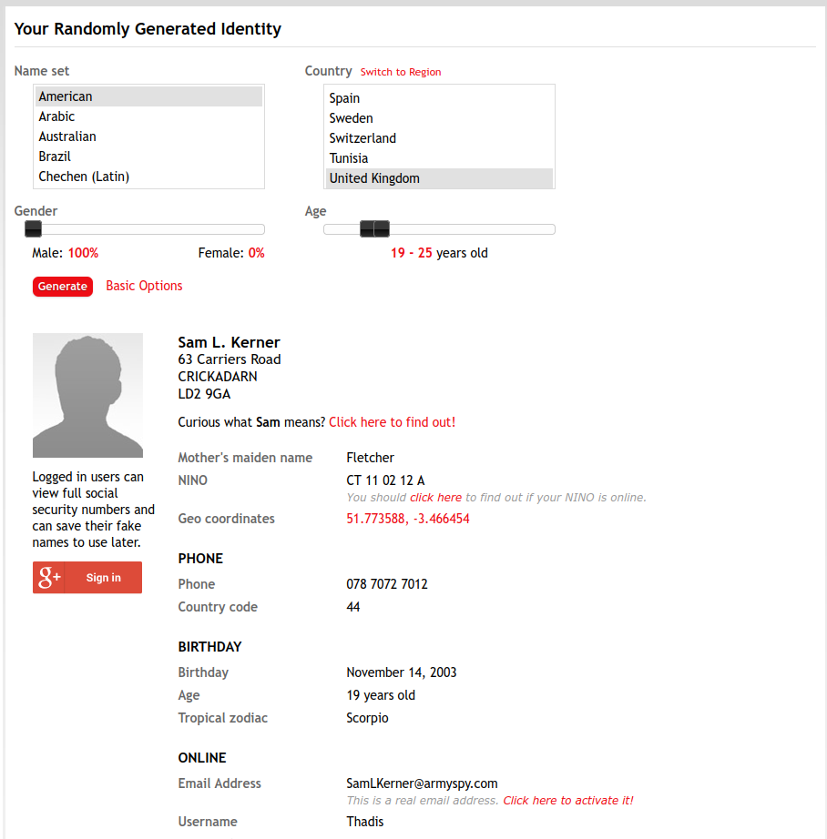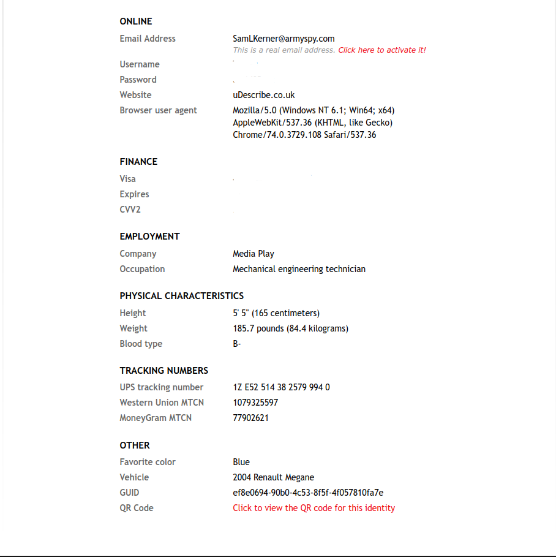

Lo que vamos a usar de esta parte es el nombre, el email, la vivienda y la fecha de nacimiento, aunque conservaremos esta información por si puede ser útil en el futuro. Tras esto he buscado una cara que pueda adecuarse al perfil creado, encuentro el siguiente:

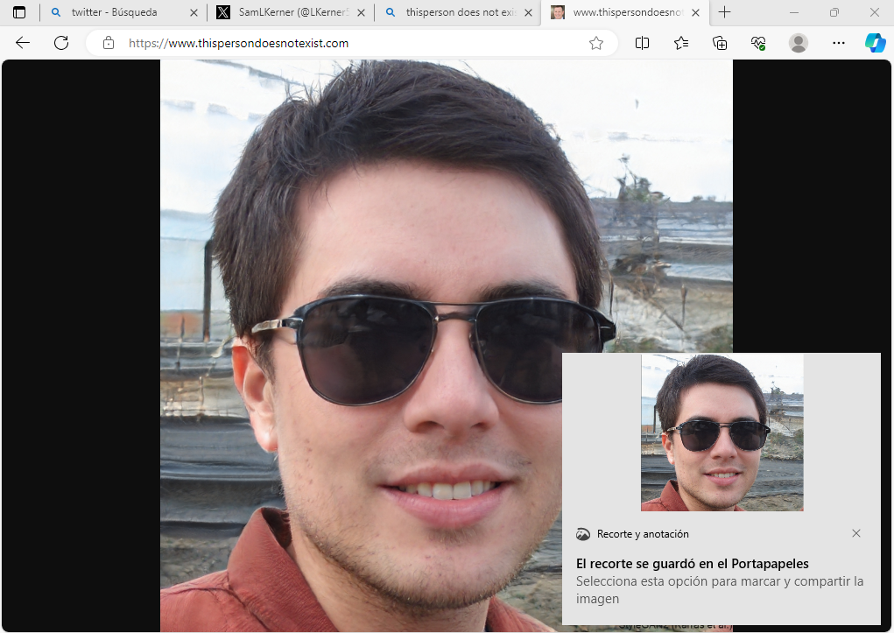

Como el fondo de la imagen se ve muy alterado debido a que está hecho por una IA, lo quito usando una herramineta online. Tras esto empezamos con la isntlación de un sistema Windows 10 en una máquina virtual, donde tras la instalación cambiaremos el idioma del sistema completamente al inglés, ya que fallé seleccionando una ISO con el idioma español.

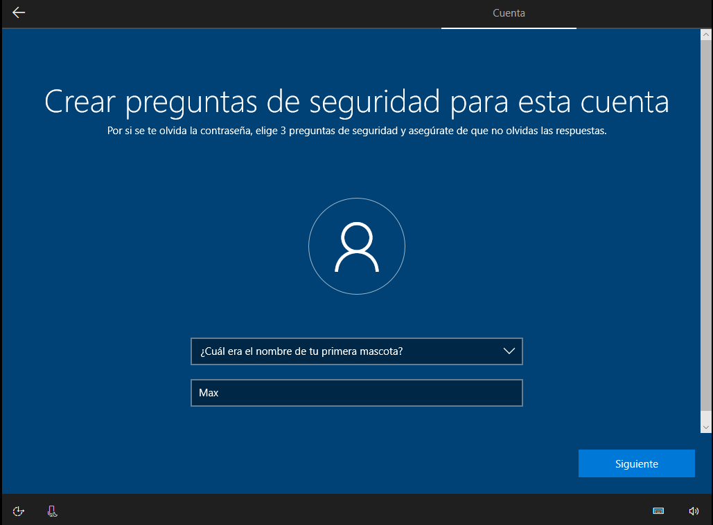

Seleccionamos todas las opciones intentando dar la menos información posible sobre el dispositivo, cuando nos hacen preguntas como la superior empiezo a crear más detalles de la persona, como que su primera mascota se llamaba Max y que nación en Liverpool, más concretamente en el siguiente hospital:

Cuando la instalación del sistema ha acabado cambiamos el diioma entero del sistema a inglés y nos descargamos [Hotspot Shield Basic](https://www.hotspotshield.com/es/).

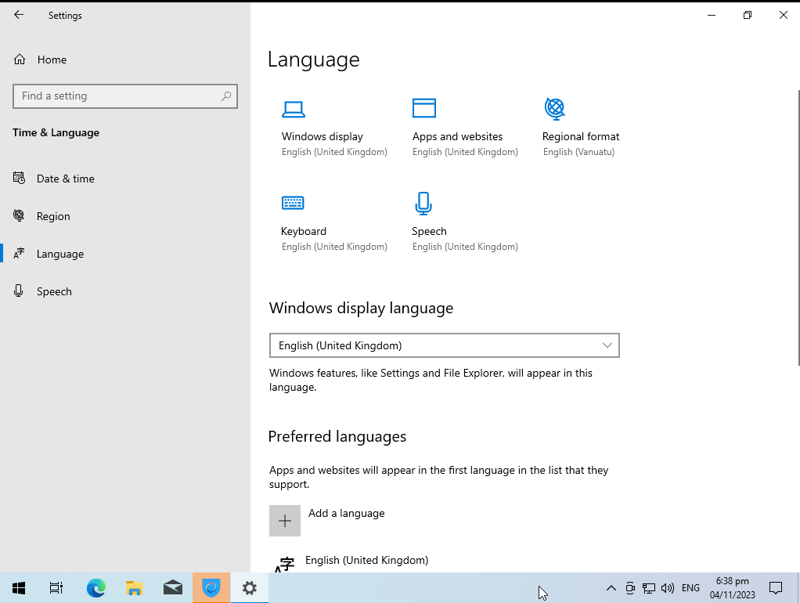
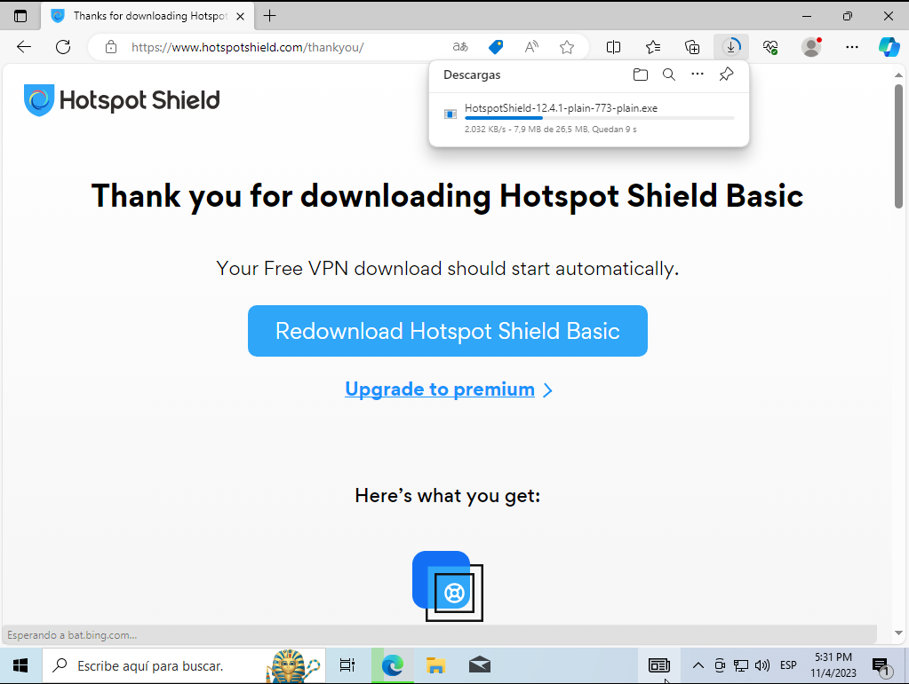

La instalación resulta ser sencilla y no necesitamos cuentas. Tras activarla obtenemos un ip de EEUU. Concretamente el estado de Carolina del Sur. Podríamos cambiarlo, pero vamos a dejarlo así, prefiero interactuar con personas de Reino Unido estando en EEUU, de forma que podamos saltar confirmaciones y quedadas en físico y poder falsificar este tipo de información de forma digital.

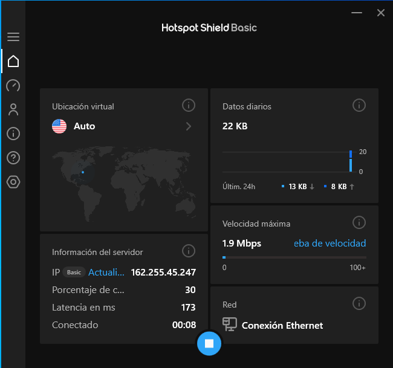

A pesar de que nuestra identidad ha nacido en Reino Unido, actualmente vive en Estados Unidos, ya que su padre encontró un mejor trabajo allí. Actualmente está estudiando Ingeniería Informática en la universidad de carolina del sur.

Ahora pasamos a la creación de una red social. Para ello vamos a usar el email que nos proporcionó la página anterior y lo activaremos, lo cual se hace de forma automática al hacer click en el enlace. Usaremos este email para registrarnos. La red social elegida es twitter, esta elección la he hecho en base a que es una red social donde no se ve raro que un usuario suba fotos suyas de forma común, además tiene funcionalidades que permiten hacer el perfil más real y conectar con más gente, como la posibilidad de unirte a comunidades.

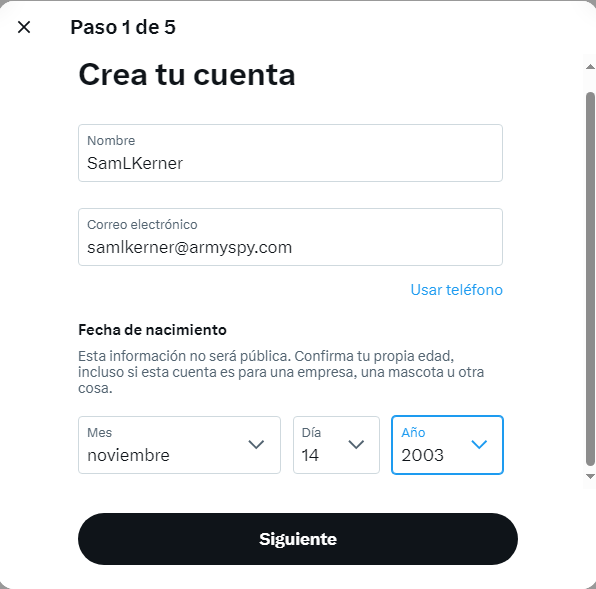

Es conveniente cambiar este email cuanto antes y pasarlo a una cuenta de gmail, pero para ello deberíamos realizar el proceso de adquirir un teléfono desechable. Por ahora con esto podemos avanzar. Recibiremos la confirmación de la creación de la cuenta al email falso:

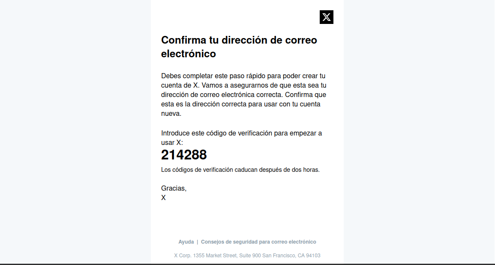

Ahora nos daremos cuenta de que las alarmas de twitter saltan ya que detectan que nuestra cuenta podría ser un bot, por lo que de forma periódica nos van a hacer comprobaciones del estilo Captcha.

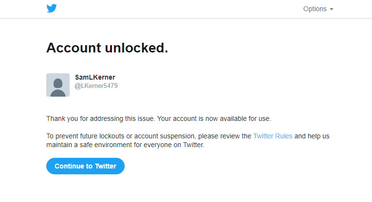

Una vez creamos nuestro perfil, he decidido darle una temática pra aumentar la credibilidad, nuestra identidad falsa tiene otra característica más, es un gran aficionado del Liverpool, además tiene intereses en los e-sports, especialmente en el videojuego CS2, también seguira cuentas de humor para gente joven. Para asentar todo esto, creamos una biografía acorde con sus gustos y nos queda algo así:

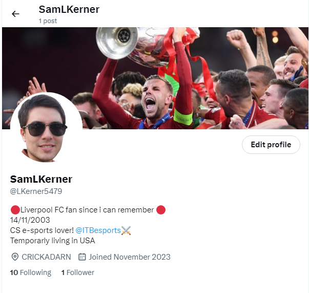

Ahora empezamos a seguir cuentas de interés y unirnos a comunidades para reforzar los gustos que hemos indicado.

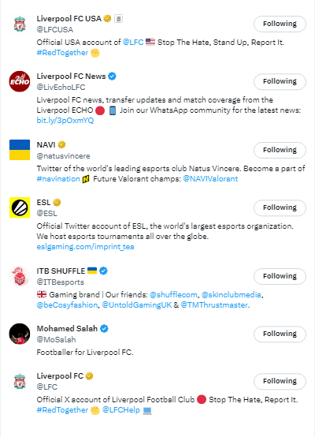
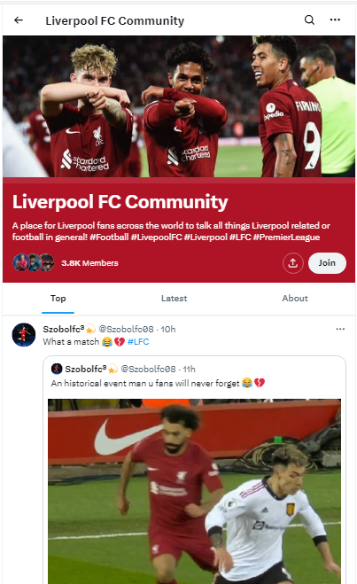

Ahora empezamos a hacer interacciones con los post de estas cuentas y muchas más. Entre las interacciones tenemos comentarios a la cuenta oficial del Liverpool, post sobre el siguiente partido y las espectativas que hay, mostrar cierto desapego al equipo Tottenham debido a las circunstancias que rodean la liga, comentarios en los post de equipos Ingleses de CS2, como Into The Breach, teniendo en cuenta que nuestro personaje está en Estados Unidos,  también tenemos comentarios sobre la situación del fentanilo y sobre problemas que está teniendo actualmente la casa blanca con protestantes pro-Palestina. El objetivo de todo esto es hacer ver al público que nuestra identidad tiene ciertas aficiones y preocupaciones generales y que pueden ser realistas.

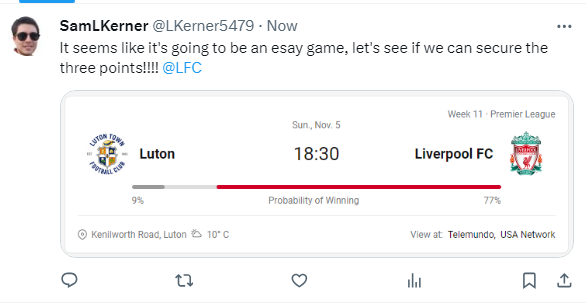
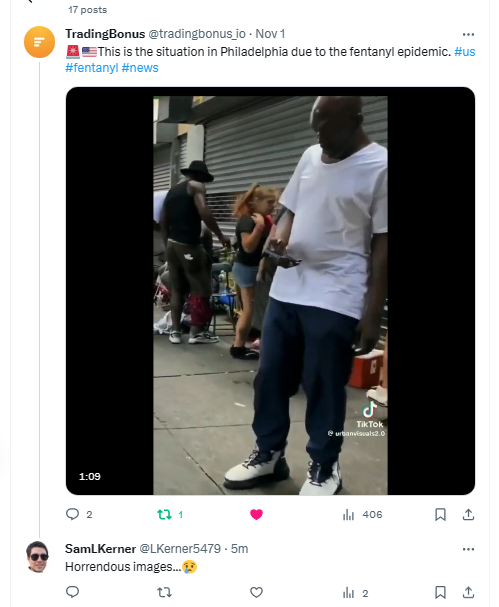

Tras todo este proceso hemos conseguido nuestro primer seguidor, siende este la ceunta de club de fans del Liverpool.

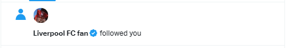
### Resumen de la identidad

Tras todo este proceso podemos resumir nuestra falsa identidad en estos puntos:
- Sam L. Kerner
- 19 años(13/11/2003) Scorpio
- Nación en Liverpool, vivió unos años en UK y ahora vive en EEUU
- Aficiones
	- Futbol, concretamente el Liverpool
	- e-sports
	- memes
- Tiene ciertas preocupaciones sobre la actualidad
- Estudia una Ingeniería Informática
- Tiene preocupaciones sobre política y el estado de la sociedad

### Cómo debería de continuar

El siguiente paso sería la adquisición de un número de teléfono desechable, con el que conseguir una cuenta de gmail, y con ella poder crear múltiples cuentas sincronizadas con la misma. Creación de otras redes sociales, un currículum, subir fotos editadas por IA que parezcan creíbles y relacionarlas con historias inventadas pero verosímiles etc.
